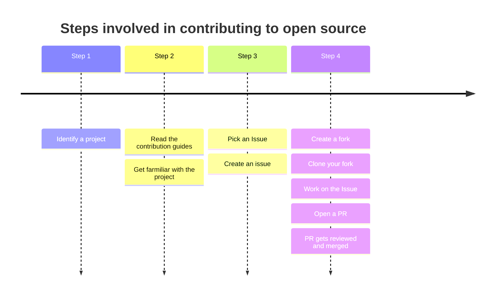

## Mystack

### How to collaborate on Github

```mermaid
timeline
    title Steps involved in contributing to open source 
    Step 1 : Identify a project
    Step 2 : Read the contribution guides
         : Get farmiliar with the project
    Step 3 : Pick an Issue
           : Create an issue
           
    Step 4 : Create a fork
           : Clone your fork
           : Work on the Issue
           : Open a PR 
           : PR gets reviewed and merged
```
